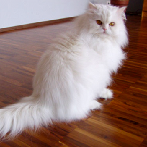
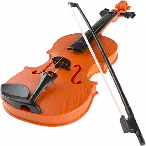

This repository is a collection of scripts for practicing Machine Learning. Each directory is a separate project.

## face-recognition-1

Follows instruction at [A Simple Introduction to Facial Recognition](https://www.analyticsvidhya.com/blog/2018/08/a-simple-introduction-to-facial-recognition-with-python-codes), contains code for a building a straightforward face recognition system using `face_recognition` library.

### Installation

- [dlib](https://gist.github.com/ageitgey/629d75c1baac34dfa5ca2a1928a7aeaf)
- [face_recognition](https://github.com/ageitgey/face_recognition#installation-options)

### Usage

```shell
$ cd face-recognition-1

$ python3 face-recognition-1.py my_image_1.jpg
Not matched: warren_buffett.jpeg
Not matched: mark_zuckerberg.jpg
Not matched: barack_obama.jpg
Not matched: jeff_bezos.jpg
Not matched: bill_gates.jpg

$ python3 face-recognition-1.py my_image_2.jpg
Not matched: warren_buffett.jpeg
Not matched: mark_zuckerberg.jpg
Not matched: barack_obama.jpg
Not matched: jeff_bezos.jpg
Matched: bill_gates.jpg

$ python3 face-recognition-1.py my_image_3.jpg
Not matched: warren_buffett.jpeg
Matched: mark_zuckerberg.jpg
Not matched: barack_obama.jpg
Not matched: jeff_bezos.jpg
Not matched: bill_gates.jpg
```

## hack-neural-network

Follows instruction at [Machine Learning is Fun Part 8: How to Intentionally Trick Neural Networks](https://medium.com/@ageitgey/machine-learning-is-fun-part-8-how-to-intentionally-trick-neural-networks-b55da32b7196), contains code for recognizing what’s in a picture using [Keras](https://keras.io/) library, then hacking it.

### Installation

- [TensorFlow](https://www.tensorflow.org/install/)
- [Keras](https://keras.io/#installation)

### Predict

Predict what is in the image:

```shell
$ cd hack-neural-network

$ python3 predict.py cat_1.png
Using TensorFlow backend.
...
This is a Persian_cat with 83.4% confidence!

$ python3 predict.py violin_2.jpeg
This is a violin with 99.37% confidence!

$ python3 predict.py toaster_1.jpg
This is a toaster with 99.92% confidence!
```

You can try with images in the `images/` folder, or use your own images.

### Hack

Item types are listed in `imagenet_classes.txt`. The number for each type is used as the 2nd argument in the following commands. For example, `#859` is "toaster", `#937` is "broccoli".

```shell
$ python3 generate_hacked_image.py cat_1.png 859
[1] [0m 07.232s] Model's predicted likelihood that the image is a toaster: 0.0038268823%
... after many loops of training ...
[1,740] [10m 06.480s] Model's predicted likelihood that the image is a toaster: 0.010005497%
[3,582] [19m 05.231s] Model's predicted likelihood that the image is a toaster: 1.0272806%
[3,604] [19m 10.804s] Model's predicted likelihood that the image is a toaster: 10.444386%
[3,611] [19m 12.551s] Model's predicted likelihood that the image is a toaster: 80.414319%
[3,628] [19m 16.863s] Model's predicted likelihood that the image is a toaster: 99.0408%
[4,147] [21m 49.601s] Model's predicted likelihood that the image is a toaster: 99.950051%
[6,406] [33m 31.711s] Model's predicted likelihood that the image is a toaster: 99.99001%
Saved hacked image to images/cat_1_99_percent_hacked.png
```

This takes 33 minutes to run on my laptop CPU (2.2 GHz 6-Core Intel Core i7) to achieve 99.99% confidence. If you have GPU configured with [CUDA](https://developer.nvidia.com/cuda-downloads), this may take just few minutes.

Verify:

```shell
$ python3 predict.py cat_1_99_percent_hacked.png
This is a toaster with 99.99% confidence!
```

The `cat_1.png` and `cat_1_99_percent_hacked.png` files are not much diffrent:

|Original|Hacked 99.99% confidence as a toaster|
|--------|------|
|||

Another run for hacking a violin as a broccoli:

```shell
$ python3 generate_hacked_image.py violin_1.jpg 937

[1] [0m 07.129s] Model's predicted likelihood that the image is a broccoli: 0.0044354263%
... after many loops of training ...
[1,314] [6m 21.409s] Model's predicted likelihood that the image is a broccoli: 0.010004077%
[5,402] [24m 48.482s] Model's predicted likelihood that the image is a broccoli: 1.0040557%
[5,645] [26m 01.211s] Model's predicted likelihood that the image is a broccoli: 10.306017%
[5,689] [26m 14.303s] Model's predicted likelihood that the image is a broccoli: 81.85823%
[5,705] [26m 22.721s] Model's predicted likelihood that the image is a broccoli: 99.027354%
[6,567] [30m 36.353s] Model's predicted likelihood that the image is a broccoli: 99.950016%
[11,616] [57m 47.924s] Model's predicted likelihood that the image is a broccoli: 99.99001%
Saved hacked image to images/violin_1_99_percent_hacked.png
```

This time it takes 57 minutes.

Verify:

```shell
$ python3 predict.py violin_1_99_percent_hacked.png
This is a broccoli with 99.73% confidence!
```

The verifying process only give us 99.73% confidence instead of 99.99% as stated in the hacking process.

|Original|Hacked 99.73% confidence as a broccoli|
|--------|------|
|||

### Troubleshooting

|Error|Solution|
|-----|--------|
|`RuntimeError: dictionary changed size during iteration`|[TensorFlow issue](https://github.com/tensorflow/tensorflow/issues/33183)|
|`ssl.SSLCertVerificationError: [SSL: CERTIFICATE_VERIFY_FAILED] certificate verify failed: unable to get local issuer certificate (_ssl.c:1056)`|[solution](https://stackoverflow.com/questions/44649449/brew-installation-of-python-3-6-1-ssl-certificate-verify-failed-certificate/44649450#44649450)|

### Further watching

Sometimes, we only need to change 1 pixel to defeat the neuron network: [One Pixel Attack Defeats Neural Networks](https://www.youtube.com/watch?v=SA4YEAWVpbk)
